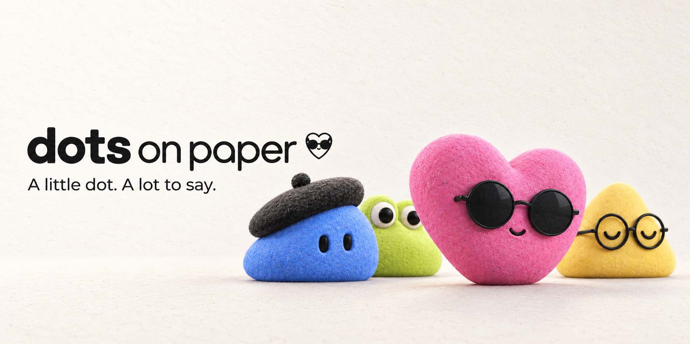
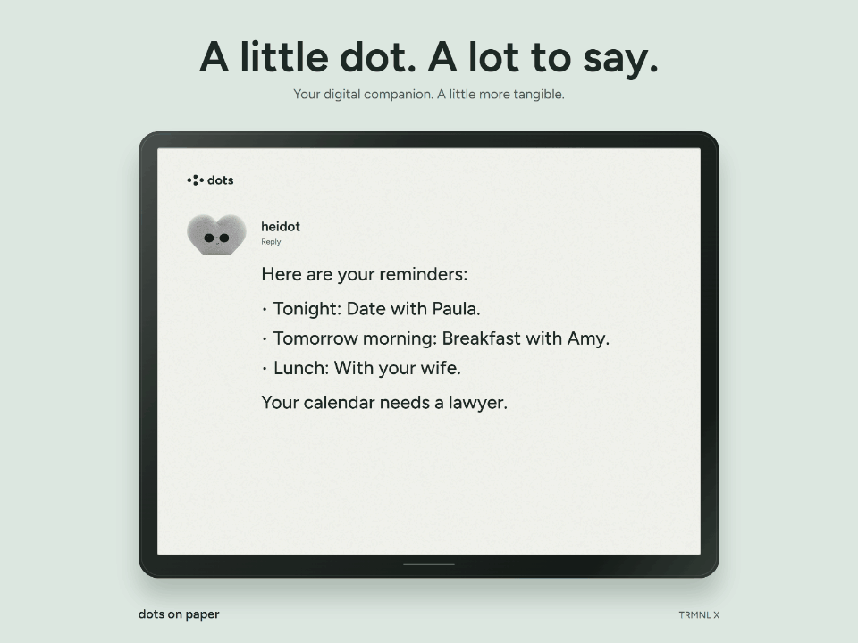

# Dots on Paper

[Meet the dots, try the demo, and set up your display](https://heinrihs.org/dotsonpaper/).

Display your dot's replies on an e-ink screen.

Dots on Paper is a local MCP and Home Assistant bridge. It stores an assistant's answer and renders a PNG or BMP for your display. Choose one of four characters; the face changes while the answer stays put.

[](campaign/media/dot-reminders.mp4)

Staged reminder example for heidot, using a fictional calendar. [Watch the MP4](campaign/media/dot-reminders.mp4) · [The "NOO" film](campaign/media/dot-noo.mp4) · [X launch package](campaign/README.md)

Authenticated publishing, rendering, browser preview, and MCP forwarding have passed local checks. The connection to a live dot account, a running Home Assistant installation, and a physical display still needs verification. [Checks and limits](docs/verification.md)

## What you get

- A local bridge with persistent replies and separate keys for publishing and reading images.
- Three MCP tools: `set_dot_status`, `publish_dot_reply`, and `get_dot_state`.
- A Home Assistant image entity, reply/status sensors, character picker, actions, and new-reply events.
- TRMNL BYOS endpoints, ESPHome and OpenEPaperLink examples, and custom PNG/BMP sizes.
- Artist, Curious, Bookish, and Cool characters.
- A standalone animation demo and editable campaign assets.

```text
Your dot or HA assistant → authenticated bridge → PNG / BMP → e-ink display
```

Publishing is an explicit tool call from the dot. During thinking, the bridge serves changing e-ink frames. When the answer arrives, it switches to one fixed result image and holds it until the next update. There is no automatic feed of every ChatGPT reply. The films use the actual e-ink renderer at an accelerated cadence; physical refresh depends on your device.

## Run the bridge

Install Python 3.11+ and Node.js 22+, then run this from the repository root:

```sh
python tools/setup.py
```

Then start it:

| Windows PowerShell | macOS / Linux |
| --- | --- |
| `.\run.ps1` | `.venv/bin/python -m dots_on_paper --data-dir ./data` |

Open http://127.0.0.1:9035 and select `data/credentials.json` in the connection panel. Setup creates a local virtual environment, installs the package, and initializes private keys without replacing or displaying them. The first screen says "Waiting for your dot."

With the bridge running, check it using `.\run.ps1 -Doctor` on Windows or `.venv/bin/python tools/doctor.py` on macOS/Linux. [Setup, LAN access, Docker, and troubleshooting](docs/setup.md)

## Connect your dot

For a cloud ChatGPT dot, use a Secure MCP Tunnel to reach the local stdio adapter. This requires a tunnel ID, a Platform runtime API key, and the relevant account and workspace permissions. Keep the bridge and tunnel client running while the dot uses the tools.

The [connection guide](docs/real-dot.md) covers the tunnel setup and portable plugin. After connecting, tell your dot:

> Use Dots on Paper for answers in this conversation. Set it to thinking when you start. Publish a short version of your actual answer when you finish.

Check that the dot can call `get_dot_state`, publish an actual answer, and show it on your display. Those steps still need testing with a live account and device. Other assistants can publish through the [REST API](docs/api.md).

heidot is the personal dot that inspired the project. Configure your own dot's display name when publishing.

## Displays and Home Assistant

| Platform | Included path | Current validation |
| --- | --- | --- |
| TRMNL / TRMNL X BYOS | Thinking pose per wake; stable result filename | Firmware contract, HTTP and renderer checked; hardware untested |
| Home Assistant | Thinking image frames, held result, conversation-agent example | Source checks; live HA runtime untested |
| ESPHome e-paper | State-aware image fetching; held result | Driver, pins, and panel refresh need your setup |
| OpenEPaperLink | HA `drawcustom` image automation | Documentation-checked; tag untested |
| Generic PNG/BMP clients, Inkplate, portrait viewers | Scoped image URL with named or custom dimensions | Renderer checked; device client required |

Copy `custom_components/dots_on_paper` into HA's `/config/custom_components/`, restart HA, and add Dots on Paper in Devices & services. Use a bridge address reachable from HA. [HA setup](examples/home-assistant/README.md) · [Profiles, authentication, and refresh behavior](docs/platforms.md)

TRMNL cloud private-plugin rendering follows a different schedule and is not connected by this release. HACS publication is also pending.

TRMNL uses a 15-second sleep while thinking and returns to the normal 60-second interval after the answer. Boot, Wi-Fi, download, and panel refresh add time. Stock TRMNL X may flash between frames; faster partial animation needs a compatible panel and driver. A sleeping device may miss a short thinking phase. [Animation setup and platform limits](docs/platforms.md#animation-and-physical-panels)

## Try the animation

```sh
node demo/serve.mjs
```

Open http://127.0.0.1:9024/?example=calendar-chaos. Switch between the four characters, try the "NOO" conversation, or write a multiline reply. The same layout handles each example, including paragraphs and lists.

The [campaign](campaign/README.md) includes GIFs, MP4s, native screen stills, and four short posts. The wife-texting exchange is a scripted draft that gets cancelled; it sends no message. The Instinct-inspired image is an independent concept. There is no Instinct connector. [Product facts](docs/product-facts.md)

## Publish and contribute

The source is on [GitHub](https://github.com/heinrihs-s/dots-on-paper). A tagged release and HACS registration are still pending. [GitHub release guide](docs/github-release.md)

The repository also includes a Codex plugin catalog:

```sh
codex plugin marketplace add heinrihs-s/dots-on-paper --ref main
```

This adds the repository as an install source on your computer. Install Dots on Paper from that source in the Plugins Directory, then follow the [connection guide](docs/real-dot.md). Public directory publication uses OpenAI's separate submission and review process. [Distribution and publishing](docs/publishing.md)

[Contributing and checks](CONTRIBUTING.md) · [Security](SECURITY.md) · [MIT license](LICENSE) · [Asset provenance](NOTICE.md)
